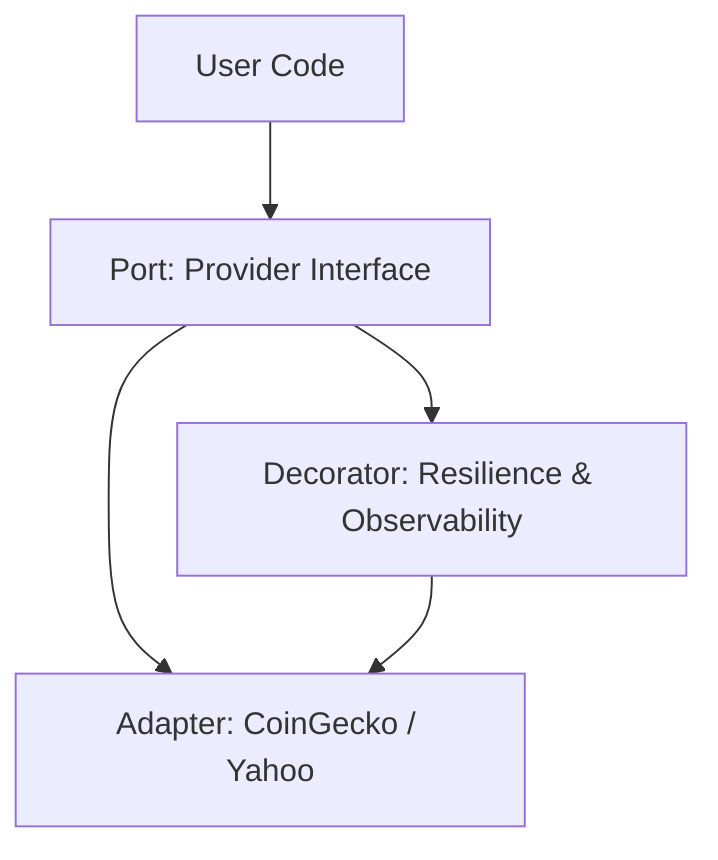

# Markets SDK Design Document

## 1. Introduction
The `markets-sdk` is designed to be a production-grade, extensible Go library for fetching financial data. This document outlines the architectural decisions and patterns used to ensure stability, maintainability, and performance.

## 2. Architecture: Hexagonal (Ports & Adapters)
We adopted the Hexagonal Architecture to separate business logic from external concerns.

### Components
- **Domain (`pkg/domain`)**: Contains pure data structures (`Quote`, `AssetType`). No external dependencies.
- **Ports (`pkg/ports`)**: Defines the `Provider` interface. The contract for data fetching.
- **Providers (`pkg/providers`)**: Implementations of the `Provider` interface (e.g., `coingecko`, `yahoo`).
- **Decorators (`pkg/decorators`)**: Middleware that wraps providers to add functionality like retries and logging without modifying the core provider logic.

## 3. Key Technical Decisions

### 3.1 Resilience via Decorators
Instead of embedding retry logic inside every provider, we use the Decorator pattern.
- **Circuit Breaker**: Prevents the system from hanging on unresponsive services.
- **Retry**: Handles transient network glitches with exponential backoff.
- **Rate Limit**: Respects API limits to avoid bans.

### 3.2 High-Performance Allocations (`sync.Pool`)
Parsing 100kb JSON responses frequently creates significant GC pressure.
- **Decision**: We use `sync.Pool` in the `CoinGecko` provider to reuse `bytes.Buffer`.
- **Result**: ~10% reduction in allocation overhead and faster processing times (verified by benchmarks).

### 3.3 Observability
The SDK is "Observable by Default" but "Agnostic by Implementation".
- **Logging**: Uses `log/slog` for structured logging.
- **Tracing**: Accepts `OpenTelemetry` interfaces.
- **Metrics**: Exposes generic metrics interfaces for Prometheus integration.

## 4. Future Considerations
- **caching**: Implement a Caching Decorator using Redis or In-Memory (LRU).
- **WS Support**: Add WebSockets for real-time tickers.
